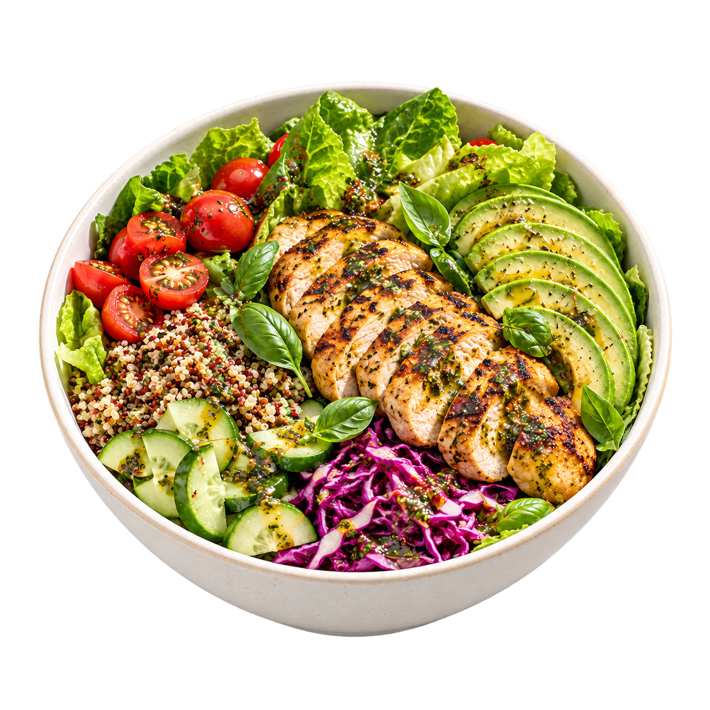
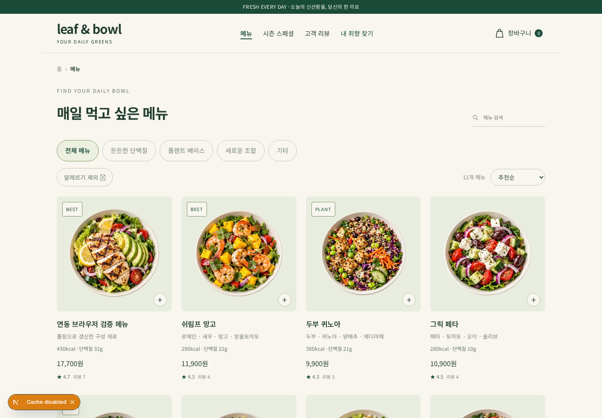
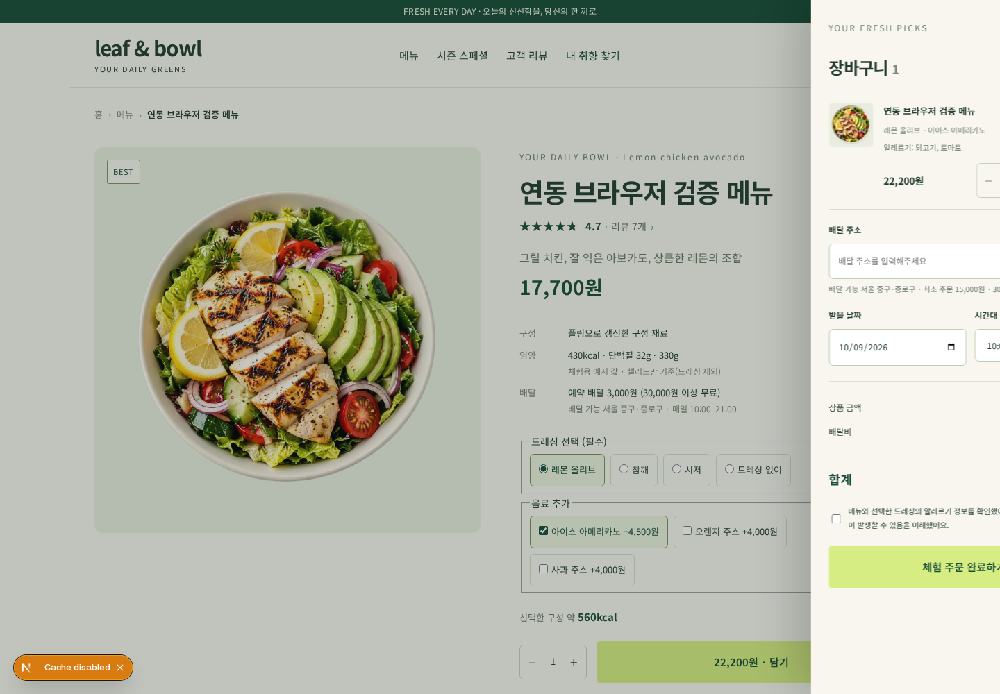

<div align="center">



# leaf & bowl

**오늘의 신선한 한 그릇**

샐러드를 고르고, 취향을 발견하고, 나만의 한 끼를 완성하는 쇼핑몰 체험 프로젝트.


[프로젝트 소개](#프로젝트-소개) · [주요 기능](#주요-기능) · [시작하기](#시작하기) · [개발 가이드](#개발-가이드) · [관련 문서](#관련-문서)

</div>

---

## 프로젝트 소개

**leaf & bowl**은 샐러드와 음료 탐색부터 옵션 선택, 장바구니, 예약 배달과 결제 화면까지 이어지는 웹 프로젝트입니다. 재료를 골라 취향에 맞는 조합을 만드는 **bowl match**와 메뉴·옵션·리뷰·사이트 문구를 관리하는 **관리자 화면**을 함께 제공합니다.

Next.js App Router 기반으로 고객 화면과 관리자 화면을 구성하고, 공통 카탈로그를 통해 저장한 변경 사항을 고객 화면에 반영합니다.

> **체험 범위** · 로그인은 실제 인증 없이 동작하는 모의 로그인입니다. 결제는 실제 청구·주문 접수·배달이 없는 체험 기능이며, 초기 리뷰는 예시 데이터입니다. 관리자 화면과 API의 인증·권한 연동은 후속 작업입니다.

## 주요 기능

| 기능 | 사용자가 할 수 있는 일 |
| --- | --- |
| 🥗 메뉴 탐색 | 샐러드·음료 목록, 상품 상세, 재료·알레르기 정보 확인 |
| 🥑 bowl match | 재료 카드를 선택해 나만의 조합을 만들고 저장 |
| 🛒 장바구니 | 드레싱·음료 옵션 선택, 수량 변경, 최신 가격으로 합계 확인 |
| 🚚 예약 배달 체험 | 배송 정보와 수령 날짜·시간대를 선택하고 결제 흐름 체험 |
| ⭐ 상품 리뷰 | 평점 분포·정렬·더보기 확인, 리뷰 작성 및 서버 저장 |
| 👤 마이페이지 | 프로필·배송지·취향 설정, 체험 주문 내역과 내 리뷰 확인 |
| 🌿 관리자 | 메뉴·옵션·재료·시즌·리뷰·매장 위치 관리, 이미지 업로드, 고객 화면 미리보기 |

### 고객 화면과 연결된 카탈로그

관리자가 **저장한** 메뉴 이름·가격·이미지·판매 상태와 사이트 문구를 고객 화면에서 함께 사용합니다. 같은 브라우저의 탭에는 저장 알림을 전달하고, 다른 접속자는 3초 간격 조회와 화면 복귀 시 갱신으로 최신 상태를 확인합니다.

숨김·삭제한 상품은 고객 목록에서 제외되고, 품절 상품은 담기·주문이 제한됩니다. 장바구니에 담긴 상품과 옵션의 가격도 최신 카탈로그를 기준으로 다시 계산합니다.

<details>
<summary><strong>카탈로그 연동 검증 화면 보기</strong></summary>

아래 이미지는 자동 갱신과 가격 재계산을 확인하기 위해 테스트용 모의 API 응답을 사용한 화면입니다.

| 메뉴 자동 갱신 | 장바구니 가격 재계산 |
| --- | --- |
|  |  |

</details>

## 기술 스택

| 영역 | 사용 기술 |
| --- | --- |
| 프레임워크 | Next.js 16.4 · App Router · Route Handlers |
| UI | React 19.3 · TypeScript 5 |
| 스타일 | Tailwind CSS 4 · 화면별 CSS |
| 컴포넌트 | Radix UI · Lucide React · Sonner |
| 데이터 검증 | Zod |
| 현재 저장소 | 서버 JSON 파일 · 브라우저 localStorage · 일부 상품 API의 메모리 저장소 |
| DB 전환 설계 | PostgreSQL 스키마·초기 데이터 SQL |
| 검증·배포 | GitHub Actions `Frontend CI` · 개발 MCP 배포 스크립트 |

## 시작하기

### 로컬 개발

CI와 동일한 **Node.js 22**, npm, Git을 준비합니다.

```bash
git clone https://github.com/KANT-2/leaf-bowl.git
cd leaf-bowl
npm ci
npm run dev
```

브라우저에서 [http://localhost:3000](http://localhost:3000)을 엽니다. 관리자 화면은 [http://localhost:3000/admin](http://localhost:3000/admin)에서 확인할 수 있습니다.

기본 실행에는 별도 환경 변수나 DB 설치가 필요하지 않습니다. 첫 카탈로그 조회 시 초기 데이터와 서버 저장 디렉터리가 자동으로 생성됩니다.

### 저장 경로 설정

| 환경 변수 | 기본값 | 용도 |
| --- | --- | --- |
| `ADMIN_DATA_DIR` | `.data/admin` | 카탈로그 JSON과 업로드 이미지의 저장 디렉터리 |

필요하면 저장소 루트의 `.env.local`에 경로를 지정합니다.

```dotenv
ADMIN_DATA_DIR=/absolute/path/to/leaf-bowl-data
```

릴리스 디렉터리를 교체하는 배포에서는 데이터를 유지하도록 고정 절대 경로를 사용합니다. 환경 변수 파일과 `.data/`는 Git에서 제외됩니다.

### 빌드와 실행

```bash
npm run build
npm run start
```

| 명령 | 설명 |
| --- | --- |
| `npm run dev` | 개발 서버 실행 |
| `npm run lint` | ESLint 검사 |
| `npm run build` | 운영 빌드 생성 |
| `npm run start` | 생성된 운영 빌드로 서버 실행 |
| `npx --no-install tsc --noEmit` | TypeScript 검사 |

Next.js가 생성하는 타입을 사용하므로 별도 타입 검사는 빌드 후에 실행합니다.

## 페이지 안내

| 경로 | 화면 |
| --- | --- |
| `/` | 홈 · 시즌 스페셜 · 메뉴 · 리뷰 |
| `/menu` | 샐러드 메뉴 목록 |
| `/drinks` | 음료 목록 |
| `/product/[id]` | 상품 상세와 옵션 선택 |
| `/product/[id]/reviews` | 상품별 리뷰 |
| `/reviews` | 기본 상품 리뷰(`/product/0/reviews`)로 이동 |
| `/match` | bowl match · 나만의 재료 조합 |
| `/login` | 체험용 로그인 |
| `/mypage` | 프로필·배송지·취향·주문 내역·내 리뷰 |
| `/checkout` | 체험용 결제 |
| `/admin` | 관리자 화면 |
| `/admin/preview` | 관리자 카탈로그 기반의 별도 고객 미리보기 |

장바구니는 고객 화면에서 열리는 드로어입니다. 기존 `/bowl-match` 주소는 `/match`로 이동합니다.

## 개발 가이드

### 프로젝트 구조

```text
leaf-bowl/
├── app/
│   ├── (customer)/       # 고객 페이지와 루트 레이아웃
│   ├── admin/            # 관리자 페이지와 루트 레이아웃
│   ├── api/              # 카탈로그·상품·리뷰·이미지 API
│   └── styles/           # 고객 화면별 스타일
├── components/           # 고객 컴포넌트·Provider·관리자 UI
├── lib/
│   ├── admin/            # 카탈로그 스키마·초기값·파일 저장소
│   ├── customer/         # 고객용 카탈로그 변환·서버 조회
│   └── …                 # 장바구니·리뷰·취향·모의 사용자/주문
├── data/                 # 초기 상품 데이터
├── types/                # 상품·API 타입
├── public/               # 상품·재료 이미지와 미리보기 자산
├── db/                   # PostgreSQL 스키마·초기 데이터
├── tests/                # 카탈로그·브라우저 검증
├── docs/                 # 설계·연동 문서와 검증 스크린샷
├── ops/                  # 배포 스크립트·운영 문서·테스트
└── .github/workflows/    # Frontend CI
```

### 데이터는 어디에 저장되나요?

| 데이터 | 현재 저장 위치 | 특징 |
| --- | --- | --- |
| 고객·관리자 공통 카탈로그와 리뷰 | 서버의 `catalog.json` | `lib/admin/store.ts`에서 조회·저장, `revision`으로 저장 충돌 확인 |
| 관리자 업로드 이미지 | 서버의 `images/` 디렉터리 | `ADMIN_DATA_DIR` 아래 보관, PNG·JPEG·WebP 및 파일당 5MB 제한 |
| 장바구니 | localStorage · `bb-cart` | 브라우저에 보존하고 최신 카탈로그로 가격·판매 가능 여부 계산 |
| 모의 사용자·프로필·배송지·취향 | localStorage · `bb-user` | 서버 계정 없이 현재 브라우저에 저장 |
| 체험 주문 내역 | localStorage · `bb-orders` | 현재 브라우저에서 최근 50개까지 보관 |
| 저장한 bowl match 조합 | localStorage · `bm-recipe` | 저장한 조합을 보존하고 카드 진행 상태는 메모리에서 관리 |
| 작성한 리뷰의 로컬 기록 | localStorage · `bb-user-reviews` | 서버 저장 리뷰와 연계해 내 리뷰 식별·기존 기록 이관에 사용 |
| 개별 상품 조회·수정 API | `lib/products-repository.ts`의 메모리 목록 | 공통 카탈로그와 별도이며 서버 재시작 시 초기화 |

PostgreSQL용 [`db/schema.sql`](db/schema.sql)과 [`db/seed.sql`](db/seed.sql)은 준비되어 있으며, **현재 앱의 저장소는 아직 PostgreSQL에 연결되어 있지 않습니다.** 전환 구조와 실행 방법은 [DB 설계 문서](docs/db-design.md)를 참고합니다.

### 구현된 API

| 메서드 | 경로 | 용도 |
| --- | --- | --- |
| `GET` | `/api/catalog` | 고객용 카탈로그 조회 |
| `GET`, `PUT` | `/api/admin/catalog` | 관리자 카탈로그 조회·전체 저장 |
| `POST` | `/api/reviews` | 고객 리뷰 작성 |
| `POST` | `/api/admin/images` | 관리자 이미지 업로드 |
| `GET` | `/api/admin/images/[key]` | 업로드 이미지 조회 |
| `GET` | `/api/products` | 메모리 기반 상품 목록·분류별 조회 |
| `GET` | `/api/products/[id]` | 메모리 기반 개별 상품 조회 |
| `PATCH` | `/api/admin/products/[id]` | 메모리 기반 상품 일부 수정 |

개별 상품 API는 공통 카탈로그와 아직 연동되지 않았습니다. 오류 응답도 카탈로그 계열의 `{ "error": "메시지" }`와 개별 상품 API의 `{ "message": "메시지" }`로 구분됩니다.

### 변경 사항 검증

기본 검증은 저장소 루트에서 아래 순서로 실행합니다.

```bash
npm ci
npm run lint
npm run build
npx --no-install tsc --noEmit
```

카탈로그 저장·이관·옵션·리뷰를 수정할 때는 `node tests/catalog.test.cjs`를, CI/CD 스크립트를 수정할 때는 `python3 -m unittest discover -s ops -p 'test_*.py' -v`를 추가로 실행합니다. 브라우저 연동 확인 절차는 [관리자·고객 연동 문서](docs/admin-integration.md)에 정리되어 있습니다.

## 배포와 협업

GitHub Actions의 **Frontend CI**는 PR과 `main`·`production` push에서 의존성 설치, 린트, 배포 스크립트 테스트, 빌드, 타입 검사를 수행합니다. 개발 MCP 배포 프로세스는 해당 브랜치 최신 커밋의 CI 성공을 확인한 뒤 서버를 교체합니다.

| 브랜치 | 역할 | 배포 환경 |
| --- | --- | --- |
| 작업 브랜치 | 기능·수정·문서 작업 | `main` 대상 PR로 검토 |
| `main` | 개발 결과 통합·검증 | 비공개 검증 앱 · 포트 3100 |
| `production` | 운영 배포 기준 | 공개 운영 앱 · 포트 3200 |

작업은 **이슈 → 작업 브랜치 → PR** 순서로 진행합니다. 일반 작업 PR은 리뷰·CI를 통과한 뒤 Squash merge하고, `main → production` 배포와 `production → main` 동기화에는 Merge commit을 사용합니다.

브랜치 보호·리뷰·Hotfix 규칙은 [AGENTS.md](AGENTS.md), 배포 준비·상태 확인·복구 방법은 [운영 가이드](ops/README.md)를 따릅니다.

## 관련 문서

| 문서 | 내용 |
| --- | --- |
| [저장소 작업 지침](AGENTS.md) | 이슈·계획·브랜치·PR·코드리뷰 규칙 |
| [관리자·고객 연동](docs/admin-integration.md) | 공통 카탈로그, 데이터 이관, 브라우저 검증 절차 |
| [DB 설계](docs/db-design.md) | PostgreSQL ERD, 테이블 매핑, 저장소 전환 계획 |
| [배포·운영](ops/README.md) | 개발 MCP 배포, CI 게이트, 로그와 복구 |

---

<p align="center"><strong>FRESH EVERY DAY</strong><br />오늘의 신선함을, 당신의 한 끼로.</p>
