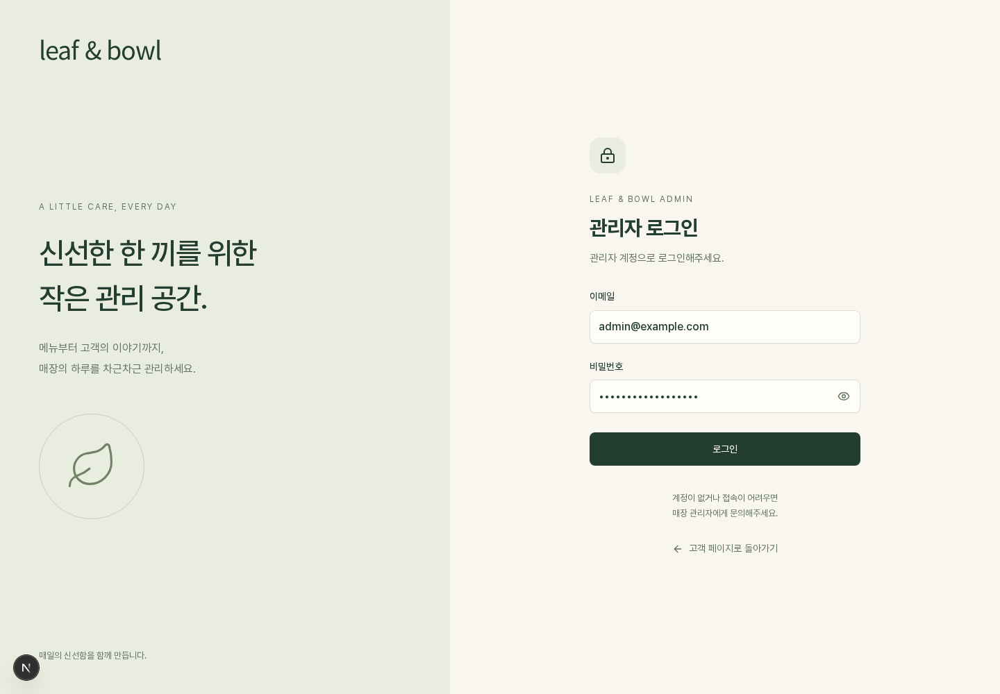
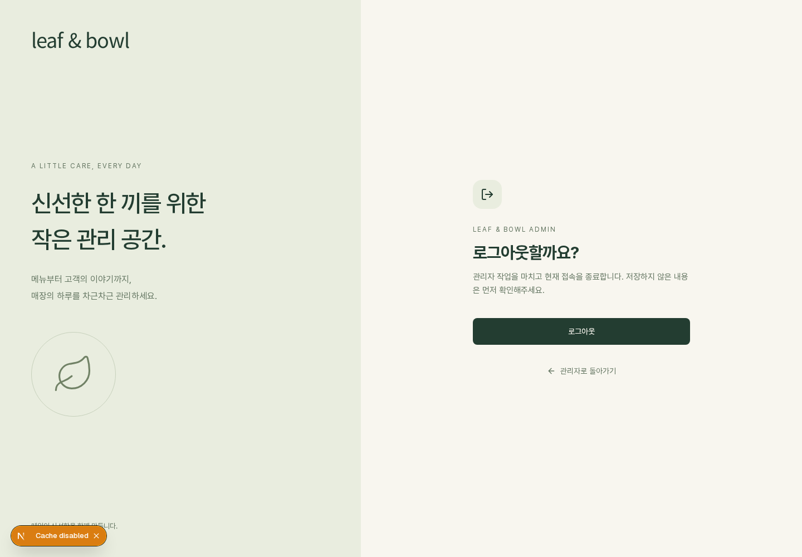
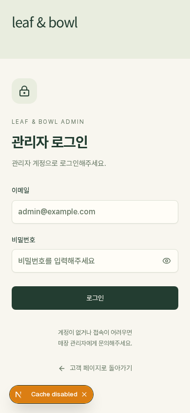

# 관리자 인증 화면 연결

## 현재 범위

`/admin/login`, `/admin/logout`은 관리자 전용 인증 프론트엔드다. 고객 `/login` 및 `bb-user`와 독립적이며, 비밀번호나 관리자 인증 정보를 localStorage/sessionStorage에 저장하지 않는다.

현재 인증 API는 `ADMIN_LOGIN_ID`, `ADMIN_PASSWORD`로 설정한 관리자 계정과 서버 세션을 사용한다. 화면은 임의 로그인·임시 세션을 생성하지 않는다. 따라서 이 변경만으로 `/admin`, `/admin/preview`, `/api/admin/*` 접근이 제한되지는 않는다. 실제 보안 적용은 `docs/backend-design.md`의 identity 구현에서 서버 세션 검사와 함께 진행해야 한다. 계정 생성·회원가입은 포함하지 않는다.

## 연결 제안

아래 요청 본문과 응답 규칙은 프론트엔드 연결 제안이며, 백엔드의 최종 확정 계약이 아니다. 경로는 기존 백엔드 설계에 맞췄다. 담당자는 `lib/admin/auth-client.ts`를 조정할 수 있다.

| 동작 | 요청 | 성공 후 |
| --- | --- | --- |
| 로그인 | `POST /api/v1/auth/login`, JSON `{loginId, password}` (아이디 최대 50자, 비밀번호 최대 200자) | `/admin`으로 전체 페이지 이동 |
| 로그아웃 | `POST /api/v1/auth/logout`, JSON `{}` | 완료 화면과 재로그인·고객 페이지 링크 |

- 성공은 JSON 2xx 또는 본문 없는 204로 응답한다. 서버는 관리자 HttpOnly 세션 쿠키를 발급·폐기한다. 비밀번호와 세션 토큰을 응답 본문에 전달하지 않는다.
- 로그인 401: 아이디·비밀번호 오류. 로그아웃 401: 이미 세션이 없으므로 완료 상태로 처리한다.
- 429: 재시도 대기 안내. 404/405/501: 인증 서비스 미연결 안내. 기타 오류·네트워크 실패·15초 시간 초과: 실패 상태를 표시하며 성공 이동을 하지 않는다.
- 로그아웃은 페이지 조회 시 자동 실행하지 않으며 확인한 POST 요청으로만 실행한다. 실제 CSRF 방어 방식에 따라 요청 어댑터에 토큰 헤더 등이 추가로 필요할 수 있다.

## 백엔드 연결 완료 기준

- 관리자 계정·비밀번호 해시·서버 세션 및 만료 구현
- 관리자 화면·미리보기와 모든 관리자 API의 권한 검사
- CSRF 방어·요청 제한·HTTPS 쿠키 적용
- 세션 상태에 따른 상단 로그인/로그아웃 버튼 전환
- 로그아웃 이후 뒤로 가기·직접 URL·API 재요청 접근 차단

UI 단독 검증의 성공은 이 보안 완료 기준을 대신하지 않는다.

## 화면 및 검증

Playwright로 실제 미연결 API 안내와 비밀번호 표시 전환을 확인했다. 성공·401·네트워크 실패·로그아웃 저장 실패와 재시도·204 성공은 브라우저 요청 가로채기로 검증했으며, 실제 관리자 인증 검증이 아니다. 모바일 390px에서 가로 넘침과 브라우저 실행 예외가 없었다.
