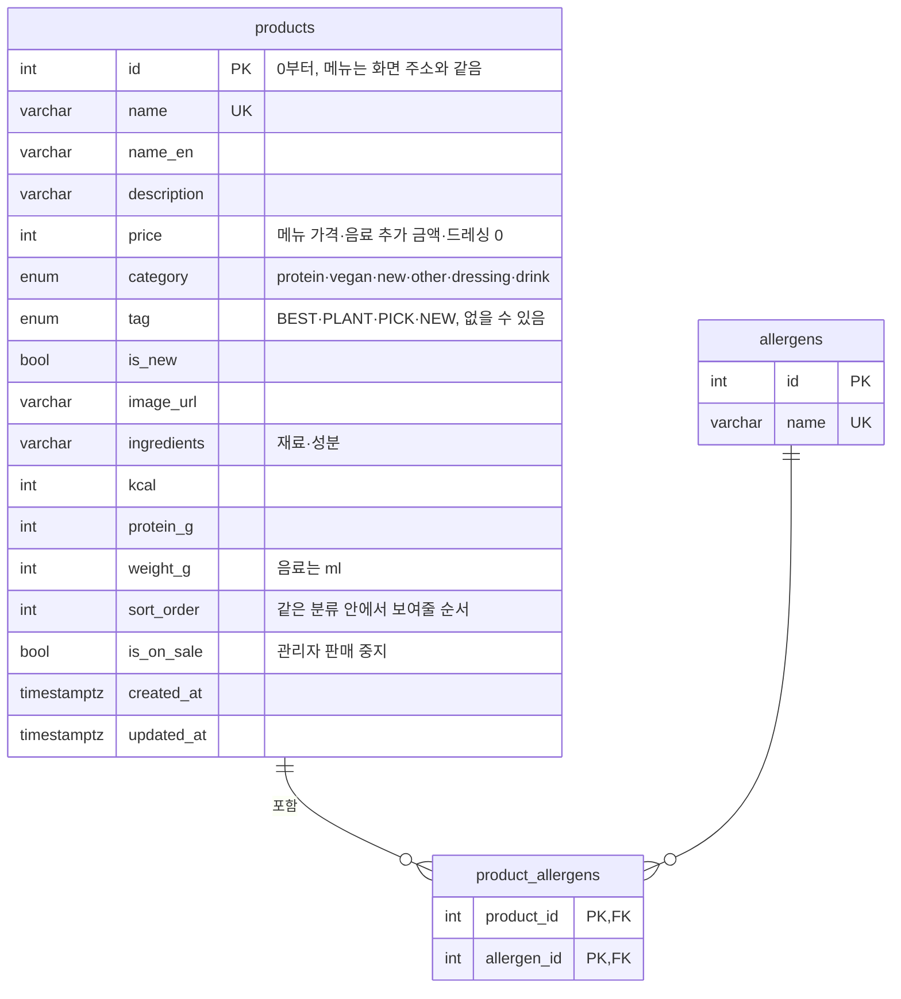
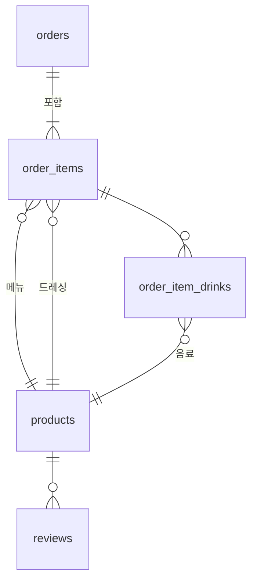

# leaf & bowl DB 설계

PostgreSQL · 정민님 원격 리눅스 서버에서 실행 · 작성: 안형준 (백엔드)

## 범위

| 단계 | 테이블 | 쓰는 곳 |
| --- | --- | --- |
| **1단계 (이번)** | products, allergens, product_allergens | 고객 메뉴·상세, 관리자 상품 수정, 상품 API |
| 2단계 (확장) | orders, order_items, order_item_drinks, reviews, admin_users | 주문 저장, 리뷰 저장, 관리자 로그인 |

과제 제외 범위(로그인·주문 서버 저장)와 겹치는 2단계는 필수 범위를 마친 뒤 진행한다.

## ERD (1단계)



| category | 데이터 | id | price 뜻 |
| --- | --- | --- | --- |
| `protein` · `vegan` · `new` · `other` | 메뉴: 샐러드 10 · 세트 2 | 0~11 | 판매 가격 |
| `dressing` | 레몬 올리브 · 발사믹 · 참깨 · 시저 · 드레싱 없이 | 12~16 | 항상 0 (무료) |
| `drink` | 아이스 아메리카노 · 오렌지 · 사과 · 케일 그린 주스 | 17~20 | 추가 금액 |

## 설계 결정

| 결정 | 이유 |
| --- | --- |
| 메뉴·드레싱·음료를 products 한 테이블로, category 로 구분 | 관리자가 메뉴 가격, 음료 추가 금액, 판매 중지를 한 화면·한 API로 관리한다. 알레르기 연결도 테이블 하나로 끝난다 |
| 모든 컬럼 NOT NULL (뱃지 tag 만 예외) | 드레싱·음료도 영문명·설명·재료·칼로리·단백질·중량을 실제로 가진다. 빈 값이 없어 조회·화면 코드가 단순하다 |
| 드레싱·음료에 뱃지·신메뉴 금지 (`chk_option_no_badge`) | BEST·NEW 같은 표시는 메뉴에만 의미가 있다 |
| 드레싱 가격 0 고정 (`chk_dressing_free`) | 모든 드레싱이 무료. 유료 드레싱이 생기면 이 규칙만 지운다 |
| 알레르기를 별도 테이블 + 연결 테이블로 분리 (N:M) | "우유가 들어간 메뉴" 같은 조회가 쉽고, 같은 재료가 오타로 두 번 생기지 않는다(UNIQUE) |
| category, tag 를 ENUM 으로 | 정해진 값 외에는 DB가 거부한다 |
| 가격·칼로리·단백질·중량에 CHECK (0 이상) | 관리자 화면에서 잘못된 값이 들어와도 DB에서 한 번 더 막는다 |
| products.id 를 0부터 | 현재 화면 주소(/product/0)와 컴포넌트가 배열 위치를 id로 쓰고 있어 메뉴를 0~11로 맞춘다. seed 후 시퀀스를 최댓값으로 맞춰 새 상품은 21번부터 |
| 상품 삭제 대신 is_on_sale | 지난 주문이 상품을 참조하므로(2단계) 지우지 않고 판매 중지로 숨긴다 |

### 한 테이블로 합쳐서 지킬 규칙

- 조회는 `lib/products-repository.ts` 한 곳에서만 하고, 메뉴·드레싱·음료를 **category 조건으로 나눠 읽는 함수**(findMenus, findDressings, findDrinks)만 쓴다. 조건을 빠뜨리면 메뉴 목록에 드레싱이 섞인다.
- 메뉴만 볼 때: `WHERE category NOT IN ('dressing', 'drink')`
- 관리자 수정 API는 드레싱·음료의 tag·isNew 수정 요청을 DB에 보내기 전에 400 으로 막는다.
- 2단계 주문에서 "드레싱 칸에 음료 id" 같은 잘못된 참조는 외래키가 막지 못하므로 주문 저장 API에서 category 를 확인한다.

## 화면 데이터 ↔ DB

| 화면 코드 | DB |
| --- | --- |
| `PRODUCTS` (data/products.ts) | `category NOT IN ('dressing','drink') ORDER BY sort_order` |
| `DRESSINGS` | `category = 'dressing' ORDER BY sort_order` |
| `DRINKS` | `category = 'drink' ORDER BY sort_order` |
| `en`, `imageUrl`, `isNew` | `name_en`, `image_url`, `is_new` (snake_case) |
| `allergens: string[]` | `product_allergens` → `allergens.name` |
| `NUTRITION[id]`, `DRESSING_KCAL`, `DRINK_KCAL` (lib/products.ts) | `kcal`, `protein_g`, `weight_g` |

화면은 드레싱·음료를 배열 위치(0부터)로 고르므로, DB id(12~20)가 아니라 `sort_order` 순서로 읽어 배열로 만든다.
코드의 `Category` 타입(types/product.ts)은 메뉴 분류 4개만 가지며, `dressing`·`drink` 는 DB에서만 쓴다.
드레싱·음료의 영문명·설명·재료·단백질·중량은 seed 의 예시 값이다.

## 2단계 초안 (확장)



- orders: 수령 방식(pickup·delivery), 매장 또는 배달 주소, 수령 시간대, 합계, 상태
- order_items: 메뉴, 드레싱, 수량, **주문 당시 가격**(상품 가격이 바뀌어도 주문 금액 유지)
- order_item_drinks: 주문 항목에 추가한 음료와 주문 당시 추가 금액
- reviews: 메뉴, 별점(1~5 CHECK), 내용, 작성일
- admin_users: 관리자 아이디, 비밀번호 해시

## 실행 방법

```bash
psql "$DATABASE_URL" -f db/schema.sql
psql "$DATABASE_URL" -f db/seed.sql
```

DBeaver 에서는 SQL 편집기에 파일 내용을 붙여넣고 **스크립트 실행(Alt+X)** 으로 schema.sql → seed.sql 순서로 실행한다.

## 정민님께 확인할 것

- [ ] 테이블 구조 검토 (메뉴·드레싱·음료를 category 로 통합, 전 컬럼 NOT NULL, id 0부터, 알레르기 N:M)
- [ ] DB 이름·계정 생성, DATABASE_URL 전달
- [ ] 스키마 변경 방식: SQL 파일로 관리할지, Prisma 마이그레이션을 쓸지
