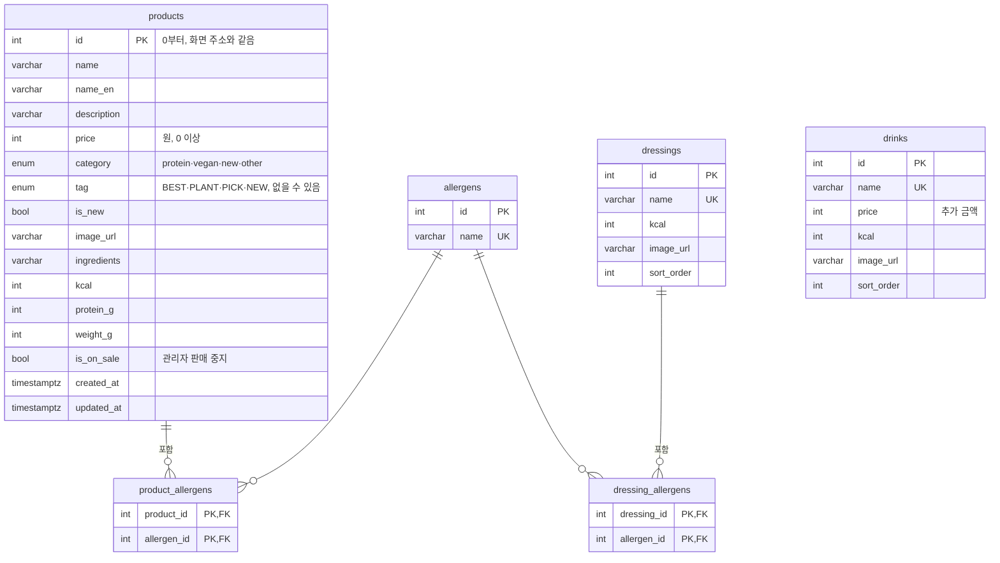
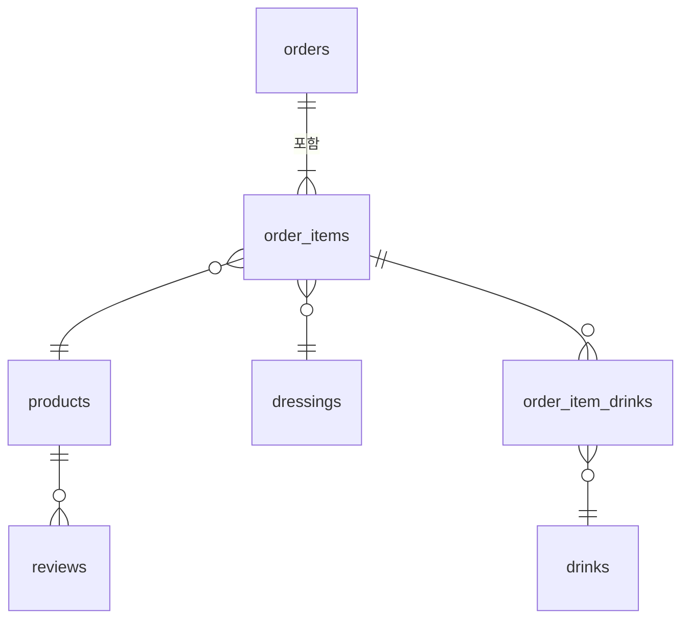

# leaf & bowl DB 설계

PostgreSQL · 정민님 원격 리눅스 서버에서 실행 · 작성: 안형준 (백엔드)

## 범위

| 단계 | 테이블 | 쓰는 곳 |
| --- | --- | --- |
| **1단계 (이번)** | products, allergens, product_allergens, dressings, dressing_allergens, drinks | 고객 메뉴·상세, 관리자 상품 수정, 상품 API |
| 2단계 (확장) | orders, order_items, order_item_drinks, reviews, admin_users | 주문 저장, 리뷰 저장, 관리자 로그인 |

과제 제외 범위(로그인·주문 서버 저장)와 겹치는 2단계는 필수 범위를 마친 뒤 진행한다.

## ERD (1단계)



`drinks` 는 다른 테이블과 연결이 없다. 상품과 상관없이 모든 메뉴에 같은 음료를 추가할 수 있기 때문이다.

## 설계 결정

| 결정 | 이유 |
| --- | --- |
| 알레르기를 별도 테이블 + 연결 테이블로 분리 (N:M) | 상품과 드레싱이 같은 알레르기 목록을 공유한다. "우유가 들어간 메뉴" 같은 조회가 쉽고, 오타로 같은 재료가 두 번 생기지 않는다(UNIQUE) |
| category, tag 를 ENUM 으로 | 정해진 값 외에는 DB가 거부한다. types/product.ts 의 타입과 1:1 |
| 가격·칼로리에 CHECK (0 이상) | 관리자 화면에서 잘못된 값이 들어와도 DB에서 한 번 더 막는다 |
| products.id 를 0부터 | 현재 화면 주소(/product/0)와 컴포넌트가 배열 위치를 id로 쓰고 있어 맞춘다. seed 후 시퀀스를 최댓값으로 맞춰 새 상품은 12번부터 |
| 상품 삭제 대신 is_on_sale | 지난 주문이 상품을 참조하므로(2단계) 지우지 않고 판매 중지로 숨긴다 |
| 영양 정보를 products 컬럼으로 | 상품 1개당 값이 1개씩이라 별도 테이블이 필요 없다 |
| 드레싱 가격 컬럼 없음 | 모든 드레싱이 무료. 유료가 생기면 컬럼 추가 |

## 화면 데이터 ↔ DB 컬럼

| types/product.ts | products 컬럼 |
| --- | --- |
| id, name, price, category, tag, imageUrl, description, isNew, ingredients | 같은 이름 (snake_case) |
| en | name_en |
| allergens: string[] | product_allergens → allergens.name |
| NUTRITION[id] (lib/products.ts) | kcal, protein_g, weight_g |

## 2단계 초안 (확장)



- orders: 수령 방식(pickup·delivery), 매장 또는 배달 주소, 수령 시간대, 합계, 상태
- order_items: 상품, 드레싱, 수량, **주문 당시 가격**(상품 가격이 바뀌어도 주문 금액 유지)
- reviews: 상품, 별점(1~5 CHECK), 내용, 작성일
- admin_users: 관리자 아이디, 비밀번호 해시

## 실행 방법

```bash
psql "$DATABASE_URL" -f db/schema.sql
psql "$DATABASE_URL" -f db/seed.sql
```

DBeaver 에서는 SQL 편집기에 파일 내용을 붙여넣고 **스크립트 실행(Alt+X)** 으로 schema.sql → seed.sql 순서로 실행한다.

## 정민님께 확인할 것

- [ ] 테이블 구조 검토 (특히 id 0부터 시작, 알레르기 N:M)
- [ ] DB 이름·계정 생성, DATABASE_URL 전달
- [ ] 스키마 변경 방식: SQL 파일로 관리할지, Prisma 마이그레이션을 쓸지
