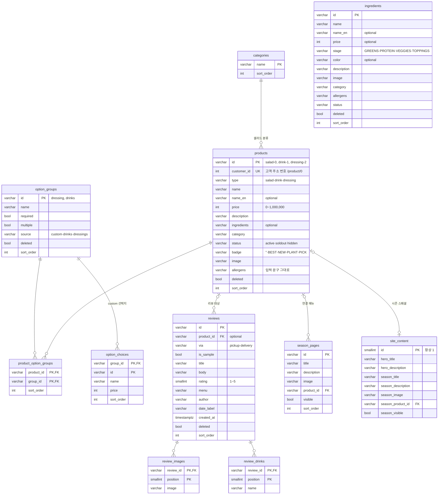

# leaf & bowl DB 설계

PostgreSQL · 정민님 원격 리눅스 서버에서 실행 · 작성: 안형준 (백엔드)

## 목표

관리자 기능(#16)은 지금 카탈로그 전체를 `.data/admin/catalog.json` 한 파일에 저장한다.
이 설계는 같은 데이터를 PostgreSQL 테이블로 옮긴다. **화면과 API(`/api/admin/catalog`)는 그대로 두고**,
`lib/admin/store.ts` 의 `readCatalog` · `writeCatalog` 안쪽만 DB 조회·저장으로 바꾸는 것이 목표다.

기준: `lib/admin/catalog.ts` 의 `catalogSchema` (main) + `feat/22-shared-catalog` 에서 추가된 항목.

## ERD



ERD 외에 1행짜리 테이블 2개가 더 있다: `catalog_meta` (저장 버전 revision), `store_location` (매장 위치).
`ingredients` 는 다른 테이블과 연결이 없다 (bowl match 화면에서만 쓴다).

## 관리자 데이터 ↔ 테이블

| catalog.json | 테이블 |
| --- | --- |
| `revision`, `updatedAt` | catalog_meta |
| `location` | store_location |
| `categories[]` | categories (배열 순서 → sort_order) |
| `products[]` | products |
| `products[].optionIds[]` | product_option_groups |
| `groups[]` | option_groups |
| `groups[].choices[]` | option_choices |
| `ingredients[]` | ingredients |
| `reviews[]` | reviews |
| `reviews[].images[]`, `reviews[].drinks[]` | review_images, review_drinks |
| `content` (seasonPages 제외) | site_content |
| `content.seasonPages[]` | season_pages |

이름 규칙: 코드의 camelCase 는 컬럼에서 snake_case (`detailAddress` → `detail_address`, `en` → `name_en`, `sample` → `is_sample`, `date` → `date_label`).

## 설계 결정

| 결정 | 이유 |
| --- | --- |
| 관리자 카탈로그 구조를 그대로 따른다 | 화면·API 코드를 바꾸지 않고 저장소만 교체한다. 읽고 다시 쓰면 같은 JSON 이 나와야 한다 |
| 샐러드·음료·드레싱을 products 한 테이블, `type` 으로 구분 | 관리자 화면이 이미 한 목록으로 관리한다. 음료에도 BEST·NEW 뱃지가 있다 |
| 배열은 별도 테이블 + `sort_order`·`position` | 관리자가 정한 순서가 곧 화면 순서다 |
| id 는 문자열 그대로 (`salad-0`) | 관리자 화면이 id 를 만들고 옵션·시즌·리뷰가 그 id 로 서로를 가리킨다. 고객 주소용 숫자는 `customer_id` 로 따로 둔다 |
| 빈 문자열은 `''` 로 저장, optional 항목만 NULL | 관리자 데이터에서 `''`(비어 있음)와 "항목 없음"이 구분된다. 단 연결 id(`seasonProductId`, `productId`)의 `''` 는 외래키를 위해 NULL 로 바꿔 저장하고 읽을 때 `''` 로 되돌린다 |
| enum 대신 `VARCHAR + CHECK` | 값 목록이 zod 스키마와 같이 자주 바뀐다. CHECK 는 한 줄 수정으로 바뀌지만 ENUM 은 값 삭제가 어렵다 |
| 삭제는 `deleted` 플래그 | 관리자 화면이 삭제 후 복구를 지원한다. 리뷰·시즌이 가리키는 상품도 남아 있어야 한다 |
| 1행 테이블 (`id = 1` CHECK) | 매장 위치·메인 문구·저장 버전은 하나뿐이다 |
| 알레르기는 문구 그대로 (VARCHAR) | 관리자 화면이 자유 입력 문구로 받는다. 목록으로 나누는 건 화면이 바뀔 때 함께 한다 |

## 저장 방식 (store.ts 교체 계획)

| 함수 | 지금 (파일) | DB |
| --- | --- | --- |
| `readCatalog()` | catalog.json 읽기, 없으면 imported-catalog.json 으로 생성 | 테이블을 읽어 Catalog 객체로 조립 |
| `writeCatalog(catalog, revision)` | 파일 잠금 → revision 비교 → 파일 교체 | **트랜잭션** 안에서 `catalog_meta` 를 `FOR UPDATE` 로 잠그고 revision 비교 → 다르면 null(409) → 같으면 테이블 내용 교체 + revision + 1 |

관리자 화면이 저장할 때마다 카탈로그 전체를 보내므로(PUT), 처음에는 "전체 교체" 방식으로 단순하게 구현한다.
트랜잭션이라 중간에 실패하면 이전 상태가 그대로 남는다.

## 실행 방법

```bash
psql "$DATABASE_URL" -f db/schema.sql
psql "$DATABASE_URL" -f db/seed.sql
```

DBeaver 에서는 SQL 편집기에 파일 내용을 붙여넣고 **스크립트 실행(Alt+X)** 으로 schema.sql → seed.sql 순서로 실행한다.
초기 데이터: 상품 21 (샐러드 12 · 음료 4 · 드레싱 5) · 옵션 그룹 2 · 재료 18 · 리뷰 5 · 시즌 페이지 3.

## 확인할 것

- [ ] 정민님: 테이블 구조 검토, DB 이름·계정 생성, DATABASE_URL 전달
- [ ] 서현님: store.ts 의 readCatalog·writeCatalog 를 DB 로 바꾸는 것 동의, catalog.ts 변경 계획 공유
- [ ] 동현님: feat/22 의 customerId 가 샐러드 주소 번호(0~11)와 같은지
- [ ] DB 접근 방식: `pg` 로 SQL 직접 작성 / Prisma 중 선택
